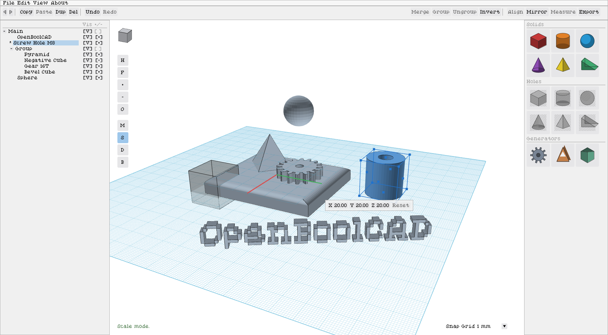

# OpenBoolCAD

The open source boolean-based computer aided design software.

## Dependencies

This project requires SDL2, OpenGL headers and the GNU C compiler for desktop builds, additionally requires emscripten sdk for WASM builds.

## Usage

OpenBoolCAD builds parts out of volumes. Every object is either solid or a hole, and merging a selection subtracts the holes from the solids. A merged object keeps its whole history, so any earlier step can still be taken apart later.

### The three panes

- **Left: the project tree.**

  Double click a name to rename it. Drag a row onto a group to move it in, or onto an object to wrap both in a new group. The two right hand columns toggle visibility and polarity. A hidden object cannot be selected at all, not even by `A`.

- **Centre: the 3D view.**

- **Right: the bookshelf.**

  Click a shape to drop it on the active editing plane, or drag it into the view to place it where you let go. Solids and Holes are the same shapes twice. Right click a cylinder, sphere or cone to choose how finely it is tessellated before it is placed - that is what a later boolean has to chew on, so a draft part and a finished one want different numbers. Generators sit below them: those ask for parameters first, so the gear opens a dialog and appears on Create.

### Moving around

| Key | Action |
| --- | --- |
| Right drag | Orbit the workspace. |
| Middle drag | Pan on the camera's own axes. |
| Scroll wheel | Zoom. |
| Page Up / Page Down | Zoom, without the mouse. |
| Click the corner cube | Snaps the view to look straight at that face. |
| `H` | Home view (the H button in the view, left edge). |
| `F` | Fit the selection to the view. |
| `O` | Switch between orthographic and perspective. |
| `T` / `Y` | Fold the project tree or the bookshelf away, for a small screen. The 3D view takes the space back. |

### Selecting

| Key | Action |
| --- | --- |
| Left click | Select the object under the cursor. |
| Shift / Ctrl click | Add or remove that object. Both modifiers do the same thing, and both toggle, so a selection can be corrected without starting over. |
| Left drag on empty space | Rubber band: selects every object the rectangle touches. |
| `A` | Select every visible object. |
| `Esc` | Clear the selection. |
| `Del` | Delete the selection. |
| `I` | Invert polarity: solid becomes hole, hole becomes solid. |

### Moving, scaling and rotating

A selection shows a box with grips on it. Which grips appear depends on the mode, so the view only ever offers what currently does something: move shows two arrows along the plane normal, scale shows the corner and face grips, rotate shows three rings. Under the box is a row of numbers - click any of them to type an exact value. In move and rotate they are the change since the marked starting point, and Reset undoes it; in scale they are absolute sizes in millimetres.

| Key | Action |
| --- | --- |
| Left drag an object | Move it in the active editing plane. |
| Arrow keys | Nudge by one grid step. The direction follows the view, so Right always moves things rightwards on screen whichever way you have orbited. |
| Drag the up / down arrow | Move along the plane normal, i.e. off the surface. |
| `S` | Scale mode. Press `S` again to return to move. |
| `D` | Rotate mode. Press `D` again to return to move. |
| `B` | Bevel mode: the object's edges light up. |
| Left / right click (bevel) | Pick an edge, or drop one again. |
| `Shift + B` | Set the bevel amount and how round it is, then apply. |
| `Shift` + drag a ring | Snap the rotation to 15 degrees. |
| `Shift` + click (rotate mode) | Pin the rotation origin to that point. `Esc` unpins it. |
| `[` and `]` | Halve or double the snap grid. |
| `Esc` | Backs out one step at a time: plane picking, then the align or mirror tool, then a pinned rotation origin, then the transform mode, then the selection. |

### Bevelling

Select one object and press `B`: every edge that has two faces meeting at an angle lights up. Left click adds an edge to the set, right click takes it out again, and `Shift+B` opens the settings. One segment gives a chamfer, more round it off. An outside corner is cut away and an inside one is filled in - which of the two an edge needs is worked out from its faces, not asked. Picking a different object in the tree while the mode is up switches to its edges.

### The editing plane

Everything above happens relative to a plane rather than to the world axes: the selection box, its grips, dragging and the arrow keys all follow it. The workplate is the default. An object's own plane is its rotation, so a turned part measures its own size instead of the size of the box around it. A face plane is laid on a surface you click, which is how you work on a slope.

New objects land on it too: off the workplate they arrive centred on the plane and turned to stand on it, so a shape added while a face plane is up sits flat on that face instead of upright through it.

| Key | Action |
| --- | --- |
| `P` | Toggle between the workplate and the selected object's own plane. |
| `Shift + P` | Plane setting: click a face and the plane lands on its centre. |
| `Ctrl + P` | The same, but the plane lands exactly where you clicked. |

### Merging, undo, align and mirror

Merging unions the selected solids, unions the selected holes, then cuts the second out of the first. With a merged object selected `Ctrl+Z` takes it apart again and `Ctrl+Y` puts it back, and that survives saving and reloading. With anything else selected the same keys are ordinary undo and redo.

A cut that lands almost flush with a surface leaves a paper-thin wall behind. Anything under 0.01 mm is dropped by the merge and reported in the status line, since no process could make it and it only causes trouble later. Real walls are left exactly as they are.

Align needs two or more objects: the first one selected is the reference and never moves, and clicking one of the nine lines slides the rest onto it. Mirror flips the selection across a plane through its middle. Both stay up so several axes can be applied in a row; `Esc` leaves. Both work on world axes, not on the editing plane.

| Key | Action |
| --- | --- |
| `Ctrl + G` | Merge the selection into one object. |
| `Ctrl + Z` | Unmerge the selected merged object, or undo the last edit. |
| `Ctrl + Y` | Remerge it, or redo. |
| `L` | Align tool. |
| `M` | Mirror tool. |

### Generators

A generator builds a shape from numbers rather than from a fixed mould, so its cell opens a dialog instead of placing something, and it cannot be dragged - there is nothing to drag until the numbers exist. Each one previews the exact outline it is about to extrude.

**Gear:** an involute spur gear, sized by module, so two gears mesh when their module and pressure angle match.

**N-sided solid:** the five regular solids as presets - a regular polyhedron only exists with 4, 6, 8, 12 or 20 faces, so those are picked rather than typed - plus prisms, antiprisms, bipyramids and pyramids, where the side count is free.

**Text:** type a word, pick a face, and it is extruded from that font's own outlines - counters like the hole in an 'o' come out as real holes. Bold is a genuine second cut where the family has one; italic is a slant, since none of the bundled faces ship an italic. Height is the height of a capital, not of the em box, so two fonts at the same setting come out the same size.

### Repairing

`Edit > Repair Meshes` runs the weld, rewind and hole fill pass over the selection and says what it changed. Every boolean already does this to its inputs, so this is for when you want it now - an STL that imported with a warning, or a part a merge has just refused. Nothing is replaced unless the repair produced something, and it is one undo step.

### Copying

Copy takes the whole subtree, so copying a group brings its contents with it, and the copy is independent geometry rather than a second name for the same object. Paste drops it a grid step off the original so it is not hidden exactly inside it. Duplicate is a copy and a paste in one that leaves the clipboard alone, so it can be repeated without losing what you copied earlier.

### Files

Projects save as `.obc`, which holds the whole tree including the history inside merged objects. STL and SVG import as objects; an SVG asks whether to extrude every shape to one height or to read its fill greyscale as a height map. Export writes the selection as STL, and a group exports merged, without changing what is on screen.

| Key | Action |
| --- | --- |
| `Ctrl + N` | New project. |
| `Ctrl + O` | Open a project. |
| `Ctrl + S` | Save. Asks for a name the first time. |
| `Ctrl + C` / `Ctrl + V` | Copy the selection, and paste it back. |
| `Ctrl + D` | Duplicate the selection without touching the clipboard. |
| `F1` | Show or hide this help. |
